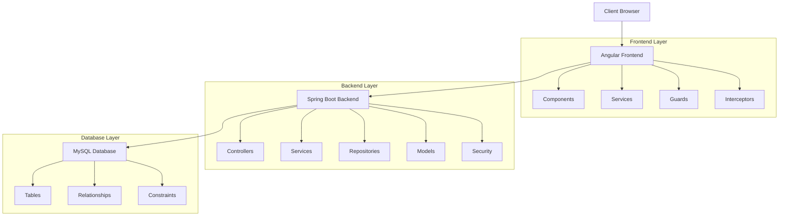
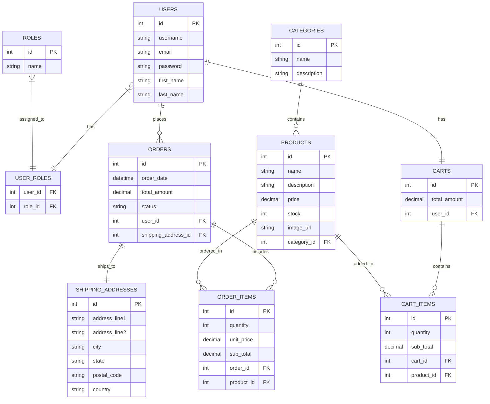

```mermaid 
graph TD
    A["Client Browser"] --> B["Angular Frontend"]
    B --> C["Spring Boot Backend"]
    C --> D["MySQL Database"]
    
    subgraph "Frontend Layer"
    B --> B1["Components"]
    B --> B2["Services"]
    B --> B3["Guards"]
    B --> B4["Interceptors"]
    end
    
    subgraph "Backend Layer"
    C --> C1["Controllers"]
    C --> C2["Services"]
    C --> C3["Repositories"]
    C --> C4["Models"]
    C --> C5["Security"]
    end
    
    subgraph "Database Layer"
    D --> D1["Tables"]
    D --> D2["Relationships"]
    D --> D3["Constraints"]
    end


```

```mermaid
erDiagram
    USERS {
        int id PK
        string username
        string email
        string password
        string first_name
        string last_name
    }
    
    ROLES {
        int id PK
        string name
    }
    
    USER_ROLES {
        int user_id FK
        int role_id FK
    }
    
    PRODUCTS {
        int id PK
        string name
        string description
        decimal price
        int stock
        string image_url
        int category_id FK
    }
    
    CATEGORIES {
        int id PK
        string name
        string description
    }
    
    ORDERS {
        int id PK
        datetime order_date
        decimal total_amount
        string status
        int user_id FK
        int shipping_address_id FK
    }
    
    ORDER_ITEMS {
        int id PK
        int quantity
        decimal unit_price
        decimal sub_total
        int order_id FK
        int product_id FK
    }
    
    SHIPPING_ADDRESSES {
        int id PK
        string address_line1
        string address_line2
        string city
        string state
        string postal_code
        string country
    }
    
    CARTS {
        int id PK
        decimal total_amount
        int user_id FK
    }
    
    CART_ITEMS {
        int id PK
        int quantity
        decimal sub_total
        int cart_id FK
        int product_id FK
    }
    
    USERS ||--o{ ORDERS : places
    USERS ||--|| CARTS : has
    USERS }|--|| USER_ROLES : has
    ROLES }|--|| USER_ROLES : assigned_to
    CATEGORIES ||--o{ PRODUCTS : contains
    ORDERS ||--o{ ORDER_ITEMS : includes
    ORDERS ||--|| SHIPPING_ADDRESSES : ships_to
    PRODUCTS ||--o{ ORDER_ITEMS : ordered_in
    CARTS ||--o{ CART_ITEMS : contains
    PRODUCTS ||--o{ CART_ITEMS : added_to

```