# -- TÜRKÇE --

## 1 - Başlangıç

### 1.1 Euler Yolu ve Königsberg Köprüleri

- Königsberg (bugünkü Kaliningrad) şehri, Pregel Nehri ile ayrılan dört kara parçası ve bunları birleştiren 7 köprüden oluşuyordu.
- Euler bu problemi bir **graf** haline getirerek modelledi: Bölgeler düğüm (vertex), köprüler kenar (edge) olarak temsil edildi.
- Amaç: Her kenardan **yalnızca bir kez** geçerek bir yürüyüş yapılıp yapılamayacağını belirlemek.

#### Temel Kavram: Euler Yolu
- Bir grafın Euler yolu varsa, **her kenardan tam bir kez geçilir.**
- **Euler Devresi** (Eulerian Circuit): Euler yolu olup **başladığı yere dönen** yol.

#### Euler’in Sonucu:
- Bir graf, bağlıysa ve:
  - **Sıfır ya da iki tane tek dereceli düğüm** varsa → **Euler yolu vardır.**
  - **Tüm düğümler çift dereceliyse** → **Euler devresi vardır.**
  - **İkiden fazla tek dereceli düğüm varsa** → **Euler yolu yoktur.**

*Königsberg grafında tüm düğümler tek dereceli olduğundan, Euler yolu yoktur.*

![[Pasted image 20250412100418.png]]

---

### 1.2 Hamilton ve Hamilton Yolu

- Sir William Rowan Hamilton (1805-1865), 1859’da her şehirden bir kez geçip başlangıç noktasına dönen bir yol üzerine kurulu bir oyuncağı ticari olarak geliştirdi.
- Bu tür yollar bugün **Hamilton Yolu** ve **Hamilton Devresi** olarak bilinir.

#### Temel Kavram: Hamilton Yolu
- **Her düğümden yalnızca bir kez geçen bir yol.**
- Hamilton Devresi: Her düğümden bir kez geçer ve başladığı noktaya döner.

*Hamilton yolları ile ilgili genel bir karar verme algoritması **NP-Tam** sınıfındadır. Yani çözümü doğrulamak kolay, ancak hızlıca çözmek zordur.*

---
### 1.3 Grafiklerin Güncel Kullanımı

- **Topluluk bulma (community detection):** Büyük sosyal ağlarda, alt toplulukların (subgraph'ların) tespiti.
- Alt yapılar: Düğümler arasında yoğun bağlantılarla oluşan kümeler.

*Bu, örneğin Facebook ya da LinkedIn gibi platformlarda, kullanıcı gruplarını tespit etmekte kullanılır.*

---
### 1.4 Büyük Grafikler

- Gerçek dünya ağları (örneğin internet, protein etkileşim ağları) **milyonlarca düğüm ve kenardan** oluşabilir.
- Bu büyüklükteki graflarda algoritmaların **ölçeklenebilirliği** kritik önemdedir.

---
### 1.5 Sıralama ve Bağlantılar

- Google'ın ilk PageRank algoritması bir **yönlendirilmiş grafik** üzerinde çalışır.
- Web siteleri düğümler, hyperlink’ler kenarlar olarak modellenir.
- Önemli siteler, çok sayıda yüksek kaliteli linke sahiptir → yüksek PageRank değeri alır.

*PageRank, özdeğer ve özvektörlere dayalı matris işlemlerini kullanır.*

---

### 1.6 & 1.7 GPS ve En Kısa Yol Problemleri

- GPS sistemleri, harita üzerindeki yolları graf olarak işler.
- **Dijkstra algoritması** ya da **A\* algoritması** gibi yollarla en kısa mesafeyi bulur.
- Kenarlar yol uzunlukları (ağırlıklı), düğümler kavşaklardır.

---
## 2. Ders İçeriği

Bu kursta neler ele alacağız:
- Grafikler hakkında temel teori
- Bağlantı
- Yollar
- Ağaçlar
- Ağlar ve akışlar
- Euler ve Hamilton grafikleri
- Renklendirme sorunları
- Karmaşıklık sorunları

Bir dizi uygulama (büyük grafiklerde):
- Grafiklerdeki büyük ölçekli sorunlar
- Büyük grafiklerdeki düğümlerin benzerliği
- Telefon sorunları ve grafikler
- Büyük grafiklerde sıralama
- Büyük grafiklerin kümelenmesi
*Graf teorisinin uygulama alanları veri madenciliğinden biyoinformatik analizine kadar uzanır.*
## 3. Graflar nedir?
### 3.1 Temel Tanım

Bir **graf** \( G = (V, E) \), düğüm (vertex) kümesi \( V \) ve kenar (edge) kümesi \( E \) ile tanımlanır. Bu küme genellikle sonludur:
- \( |V| = n \) → düğüm sayısı
- \( |E| = m \) → kenar sayısı

Bir kenar \( e_k = (v_i, v_j) \), \( v_i \) ve \( v_j \) düğümleriyle **incident** (ilişkili) kabul edilir.

vi-----ek------vj

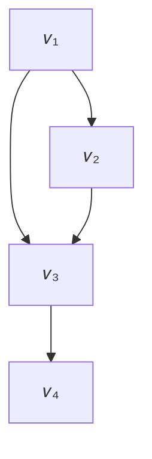

#### Basit (Simple) Graf:
- **Self-loop** (kendi kendine bağlı kenar) yoktur.
- Aynı iki düğüm arasında birden fazla kenar bulunmaz (**çoklu kenar yoktur**).

Bu şekilde olabilir.
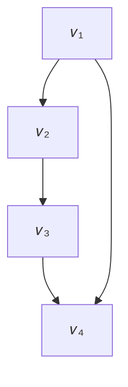
Aşağıdakinde hem self loop, hem de multiple edge var.
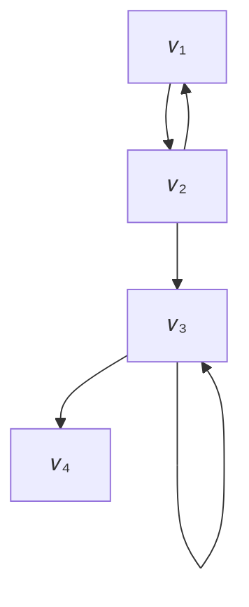

---
### 3.2 Derece ve Temel Özellikler

- Bir düğümün **derecesi** \( d(v) \): O düğüme bağlı kenar sayısıdır.
- Bir **self-loop**, dereceyi **2 artırır.**
- **İzole bir düğüm**, derecesi sıfır olan düğümdür.
#### Önerme:
Bir grafın tüm düğümlerinin dereceleri toplamı:
Kenar sayısının 2 katıdır. 
∑​ d(v) =2∣E∣
v∈V​
#### Sonuç:
Tek dereceli düğüm sayısı **her zaman çift sayıdır.**

*Bu özellik Euler yolları ve devrelerini anlamada temel teşkil eder.*

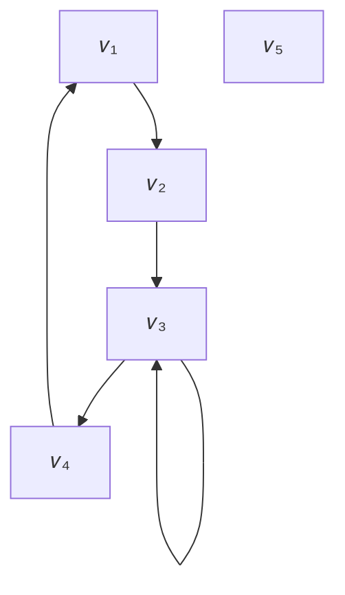
#### Bu grafın özellikleri:

- Kenar sayısı ∣E∣=5
    
- Dereceler:
    
- $d(v_1) = 2$ 
 
  - $d(v_2) = 2$
 
  - $d(v_3) = 4$ (2 kenar + 1 self-loop → 2+2)
 
  - $d(v_4) = 2$
 
  - $d(v_5) = 0$ (izole)

Toplam derece:

2+2+4+2+0=10=2×5=2∣E∣

✅ Doğrulandı!

---

### 3.3 Özel Graflar

#### Tam (Complete) Graf:
- Bütün düğümler birbiriyle bağlıdır.
- Notasyon: $K_n$ 
- Toplam Kenar sayısı: $|E| = \binom{n}{2} = \frac{n(n-1)}{2}$

- Her düğümün derecesi \( n - 1 \) 
- \( Kn \) grafı **(n−1)-regular graf**'dır.(tüm düğümler aynı dereceye sahip. )

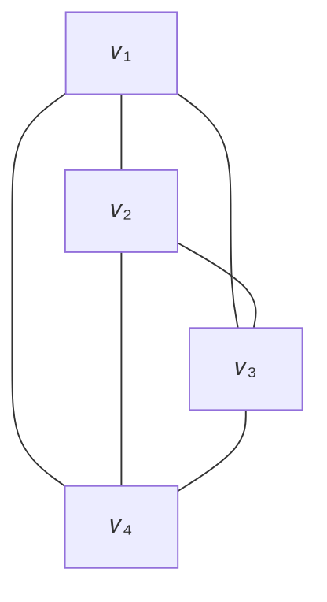

#### 🔎 İnceleyelim:

- Düğüm sayısı: n=4n = 4n=4
    
- Her düğümün derecesi: 4−1=34 - 1 = 34−1=3
    
- Kenar sayısı:$$
 |E| = \frac{4 \cdot (4 - 1)}{2} = 6 
$$
#### *k*-Düzenli (k-Regular) Graf:
- Tüm düğümlerin derecesi eşittir: \( d(v) = k \)

---

#### Bipartite (Çift Parçalı) Graf

Bir graf $G = (V, E)$ iki alt kümeye ayrılabiliyorsa:

$V = V_1 \cup V_2, \quad V_1 \cap V_2 = \emptyset$

ve **hiçbir kenar aynı alt küme içinde değilse**, o graf **bipartite** kabul edilir.

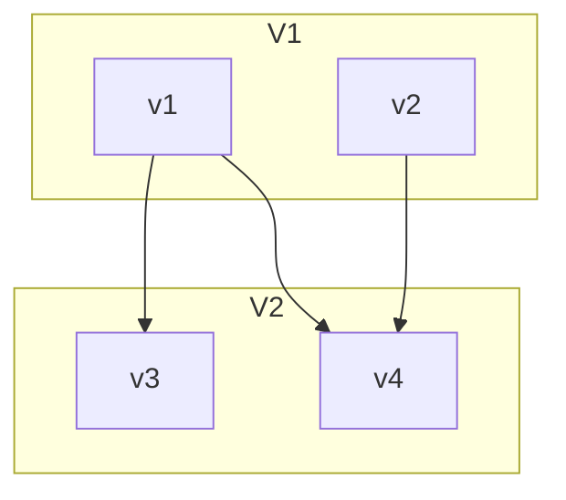

##### Tam Bipartite Graf (Complete Bipartite):
- Tüm $V_1$ ve $V_2$ düğümleri arasında kenar vardır.
- Notasyon: $K_{n_1, n_2}$
- Kenar sayısı: 

$|E| = |V_1| \cdot |V_2|$

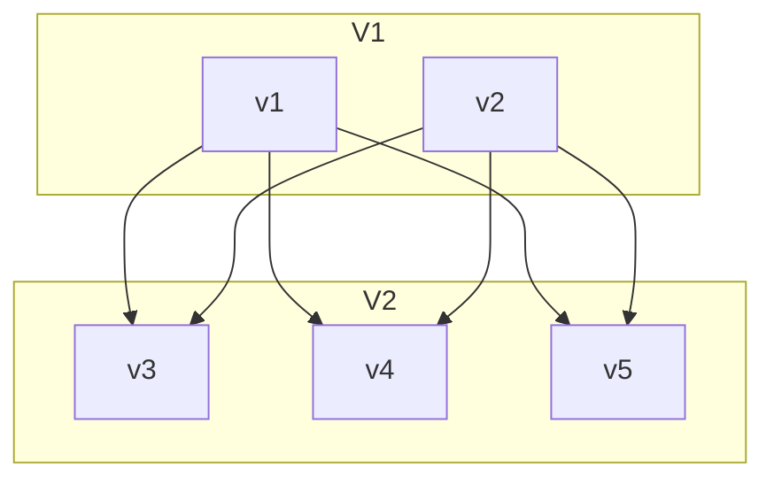

##### Ne Zaman Regular Olur?
- Eğer $|V_1| = |V_2| = k$→ Her düğümün derecesi \( k \) olur → **regular** olur.

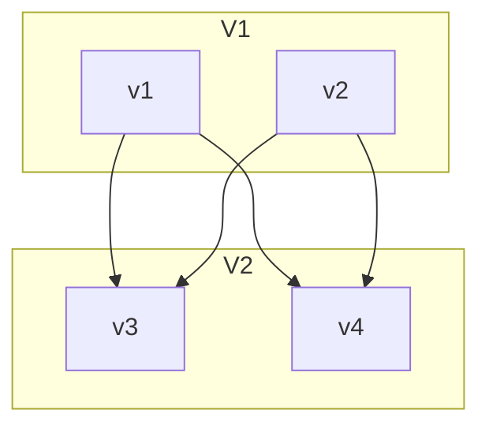

---

#### Bipartite Kontrolü: 2 Renkleme Yöntemi

Bir grafın bipartite olup olmadığını belirlemek için:

- Graf üzerinde **iki renk** (örneğin kırmızı ve mavi) kullan.
- Başlangıç düğümünü kırmızı yap → komşularını mavi → onların komşularını tekrar kırmızı, vs.
- Eğer **aynı renkte iki komşu** bulursan → **bipartite değildir.**

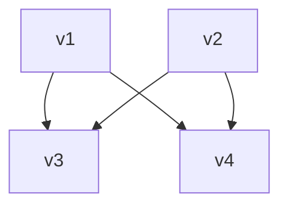

Burada:

 
- $\{v1, v2\}$ bir grup (kırmızı)
 
- $\{v3, v4\}$ diğer grup (mavi)
 
- Her kenar farklı gruplar arasında → **2 renkleme mümkün**  → ✅ **Bipartite**

---
##### Bipartite Olmama Durumu:
- Eğer graf **tekil (ganj) bir döngü** içeriyorsa ve bu döngü **tek uzunlukta (örneğin üçgen)** ise → **Bipartite olamaz.**

*Genel kural: Tüm döngülerin uzunlukları çift sayı ise graf bipartite olabilir.*

- Eğer graf **yalnızca çift uzunluklu döngüler** içeriyorsa → **Bipartite’tir.**
- Eğer en az bir tane **tek döngü** varsa → **Bipartite değildir.**

*Bu durum örneğin üçgen (3-cycle) içeren tam graf $K_3$'ün bipartite olamamasını açıklar.*

---
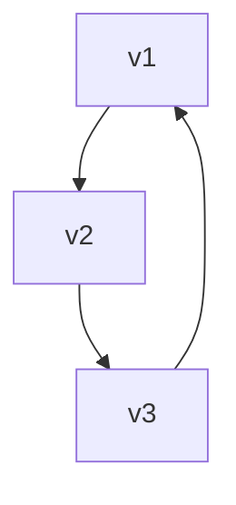

---

## 4 - Yürüyüşler, Döngüler ve Topolojik Sıralama

### 4.1 Graf Üzerinde Yürüyüş (Walk)

Bir graf üzerinde bir **walk**, ardışık kenarlar kullanılarak bir düğümden diğerine yapılan gezintidir.

- Uzunluğu \( k \) olan bir **Walk**:
 $P = (v_0, v_1, \ldots, v_k)$ -- Düğüm
 $E = \{(v_0, v_1), (v_1, v_2), \ldots, (v_{k-1}, v_k)\}$-- Kenar

A → B → C → D → B (kenarlar/düğümler tekrar edebilir)

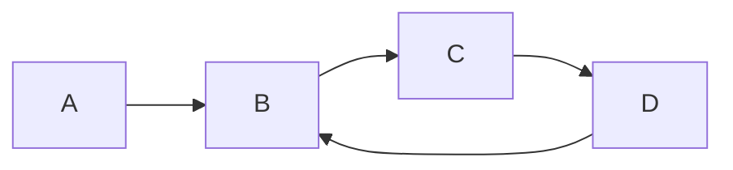

#### Terimler:
- **Trail**: Kenarlar tekrar etmez. A → B → C → D
- **Path**: Hem düğümler hem kenarlar tekrar etmez. A → B → C → D
- **Closed walk/trail**: Başladığın düğüme geri dönersin → $v_0 = v_k$
- **Cycle**: Yalnızca $v_0 = v_k$ , ilk ve son düğüm aynı, ama diğer tüm düğümler farklı. B → C → D → B

*Graf teorisinde "**walk**" en genel, "**path**" en kısıtlı yapıdır.*

---

### 4.2 Yardımcı Önermeler

- **Önerme 1:** Eğer $u \neq v$ ise ve $u \rightarrow v$ arasında bir yürüyüş varsa, bir path de vardır.

  *İpucu: Alt döngüleri sil.*
  - Eğer bir noktadan diğerine bir şekilde ulaşabiliyorsan (walk),
- O zaman aradaki döngüleri çıkartarak,
- **Tekrar içermeyen en kısa geçiş yolunu** bulabilirsin (path).

- **Önerme 2:** Tek uzunlukta kapalı bir yürüyüş, **tek uzunlukta bir döngü** içerir.

  *İpucu: Rekürsif altgraflara ayır ve indüksiyon uygula.*

#### Soru:
Bu önermeler **yalnızca simple graflar** için mi geçerlidir?

*Cevap: Evet, özellikle çoklu kenar ya da self-loop içeren graflarda dikkatli olmak gerekir.*

---

### 4.3 Yönlü Graflar (Directed Graph / Digraph)

- Kenarlar yönlüdür: \( (v_i, v_j) \) → \( v_i \) kaynak (source), \( v_j \) hedef (terminal).
- Her düğümün:
  - **Giriş derecesi**: $d_{in}(v)$
  - **Çıkış derecesi**: $d_{out}(v)$

#### Dengeli Graf:
Tüm düğümler için $d_{in}(v) = d_{out}(v)$

*Bu özellikle akış problemleri ve Euler devresi analizlerinde önemlidir.*

---

### 4.4 Topolojik Sıralama

#### Tanım:
Bir yönlü grafın düğümlerine öyle bir sıra verilir ki:
$(i, j) \in E \Rightarrow \text{ sıra}(i) < \text{ sıra}(j)$
Bu sıraya **topolojik sıralama (topological order)** denir.

- Yalnızca **acyclic** (döngüsüz) yönlü graflar (DAG) için mümkündür.

---

### 4.5 Acyclic Graf

- Döngü içermeyen graflardır.
- **Önerme:** Her acyclic graf, **en az bir tane giriş derecesi sıfır olan düğüm** içerir.

#### Kanıt (çelişki ile):
- Her düğümün bir öncecisi olduğunu varsay → Düğümler sonsuz bir döngü oluşturur → Çelişki

*Bu özellik topolojik sıralama algoritmalarında kullanılır.*

---

### 4.6 Topolojik Sıralama Algoritması

#### Algoritma: FindTopOrd(G)

1. \( t := 0 \), \( G' := G \)
2. Giriş derecesi 0 olan bir düğüm bul
3. Düğümü çıkar, sıraya ekle, \( t := t+1 \)
4. Tekrar et
5. Eğer \( t < n \) → **Graf döngü içerir**
6. Aksi takdirde → **Topolojik sıralama başarılı**

---

### 4.7 Örnek Uygulama

Adım adım:
- İlk giriş derecesi 0 olan düğüm: \( v_4 \)
- Sonrasında: \( v_3, v_1, v_2, v_5, v_6 \)
- Topolojik sıralama sonucu: 
\[
\{v_4, v_3, v_1, v_2, v_5, v_6\}
$

---

### 4.8 Zaman Karmaşıklığı

- Kaba kuvvetle: \( O(n^2) \)
- Etkili veri yapılarıyla (ör. adjacency list + queue): \( O(V + E) \)

*Topolojik sıralama, görev zamanlama, bağımlılık çözümü gibi birçok problemde kullanılır.*

## İzomorfizm

## Grafları Temsil Etme

## Bağlantılılık

## En Kısa Yol

## Ağaçlar

## Düzlemsel Graflar

## Akışlar

## Euler

## Hamilton

## Boyama

## Karmaşıklık

# -- ENGLISH --

## Appetizer

## Contents

## What are graphs? 

## Cycles 
## Isomorphism

## Representing graphs

## Connectivity

## Shortest Path

## Trees

## Planar Graphs

## Flows

## Euler

## Hamilton

## Coloring

## Complexity

