# -- TÜRKÇE --

## 1 - Başlangıç

### 1.1 Euler Yolu ve Königsberg Köprüleri

- Königsberg (bugünkü Kaliningrad) şehri, Pregel Nehri ile ayrılan dört kara parçası ve bunları birleştiren 7 köprüden oluşuyordu.
- Euler bu problemi bir **graf** haline getirerek modelledi: Bölgeler düğüm (vertex), köprüler kenar (edge) olarak temsil edildi.
- Amaç: Her kenardan **yalnızca bir kez** geçerek bir yürüyüş yapılıp yapılamayacağını belirlemek.

#### Temel Kavram: Euler Yolu
- Bir grafın Euler yolu varsa, **her kenardan tam bir kez geçilir.**
- **Euler Devresi** (Eulerian Circuit): Euler yolu olup **başladığı yere dönen** yol.

#### Euler’in Sonucu:
- Bir graf, bağlıysa ve:
  - **Sıfır ya da iki tane tek dereceli düğüm** varsa → **Euler yolu vardır.**
  - **Tüm düğümler çift dereceliyse** → **Euler devresi vardır.**
  - **İkiden fazla tek dereceli düğüm varsa** → **Euler yolu yoktur.**

*Königsberg grafında tüm düğümler tek dereceli olduğundan, Euler yolu yoktur.*

![[Pasted image 20250412100418.png]]

---

### 1.2 Hamilton ve Hamilton Yolu

- Sir William Rowan Hamilton (1805-1865), 1859’da her şehirden bir kez geçip başlangıç noktasına dönen bir yol üzerine kurulu bir oyuncağı ticari olarak geliştirdi.
- Bu tür yollar bugün **Hamilton Yolu** ve **Hamilton Devresi** olarak bilinir.

#### Temel Kavram: Hamilton Yolu
- **Her düğümden yalnızca bir kez geçen bir yol.**
- Hamilton Devresi: Her düğümden bir kez geçer ve başladığı noktaya döner.

*Hamilton yolları ile ilgili genel bir karar verme algoritması **NP-Tam** sınıfındadır. Yani çözümü doğrulamak kolay, ancak hızlıca çözmek zordur.*

---
### 1.3 Grafiklerin Güncel Kullanımı

- **Topluluk bulma (community detection):** Büyük sosyal ağlarda, alt toplulukların (subgraph'ların) tespiti.
- Alt yapılar: Düğümler arasında yoğun bağlantılarla oluşan kümeler.

*Bu, örneğin Facebook ya da LinkedIn gibi platformlarda, kullanıcı gruplarını tespit etmekte kullanılır.*

---
### 1.4 Büyük Grafikler

- Gerçek dünya ağları (örneğin internet, protein etkileşim ağları) **milyonlarca düğüm ve kenardan** oluşabilir.
- Bu büyüklükteki graflarda algoritmaların **ölçeklenebilirliği** kritik önemdedir.

---
### 1.5 Sıralama ve Bağlantılar

- Google'ın ilk PageRank algoritması bir **yönlendirilmiş grafik** üzerinde çalışır.
- Web siteleri düğümler, hyperlink’ler kenarlar olarak modellenir.
- Önemli siteler, çok sayıda yüksek kaliteli linke sahiptir → yüksek PageRank değeri alır.

*PageRank, özdeğer ve özvektörlere dayalı matris işlemlerini kullanır.*

---

### 1.6 & 1.7 GPS ve En Kısa Yol Problemleri

- GPS sistemleri, harita üzerindeki yolları graf olarak işler.
- **Dijkstra algoritması** ya da **A\* algoritması** gibi yollarla en kısa mesafeyi bulur.
- Kenarlar yol uzunlukları (ağırlıklı), düğümler kavşaklardır.

---
## 2. Ders İçeriği

Bu kursta neler ele alacağız:
- Grafikler hakkında temel teori
- Bağlantı
- Yollar
- Ağaçlar
- Ağlar ve akışlar
- Euler ve Hamilton grafikleri
- Renklendirme sorunları
- Karmaşıklık sorunları

Bir dizi uygulama (büyük grafiklerde):
- Grafiklerdeki büyük ölçekli sorunlar
- Büyük grafiklerdeki düğümlerin benzerliği
- Telefon sorunları ve grafikler
- Büyük grafiklerde sıralama
- Büyük grafiklerin kümelenmesi
*Graf teorisinin uygulama alanları veri madenciliğinden biyoinformatik analizine kadar uzanır.*
## 3. Graflar nedir?
### 3.1 Temel Tanım

Bir **graf** \( G = (V, E) \), düğüm (vertex) kümesi \( V \) ve kenar (edge) kümesi \( E \) ile tanımlanır. Bu küme genellikle sonludur:
- \( |V| = n \) → düğüm sayısı
- \( |E| = m \) → kenar sayısı

Bir kenar \( e_k = (v_i, v_j) \), \( v_i \) ve \( v_j \) düğümleriyle **incident** (ilişkili) kabul edilir.

```mermaid
graph TD
    A[𝑣₁] --> B[𝑣₂]
    A --> C[𝑣₃]
    B --> C
    C --> D[𝑣₄]
```

#### Basit (Simple) Graf:
- **Self-loop** (kendi kendine bağlı kenar) yoktur.
- Aynı iki düğüm arasında birden fazla kenar bulunmaz (**çoklu kenar yoktur**).

---

## Döngüler
## İzomorfizm

## Grafları Temsil Etme

## Bağlantılılık

## En Kısa Yol

## Ağaçlar

## Düzlemsel Graflar

## Akışlar

## Euler

## Hamilton

## Boyama

## Karmaşıklık

# -- ENGLISH --

## Appetizer

## Contents

## What are graphs? 

## Cycles 
## Isomorphism

## Representing graphs

## Connectivity

## Shortest Path

## Trees

## Planar Graphs

## Flows

## Euler

## Hamilton

## Coloring

## Complexity

